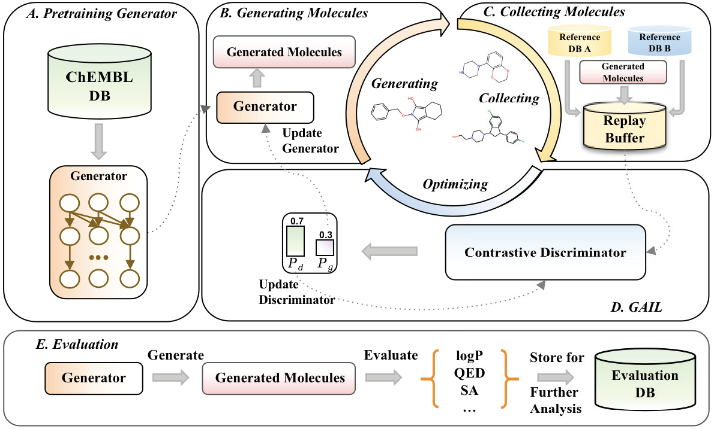
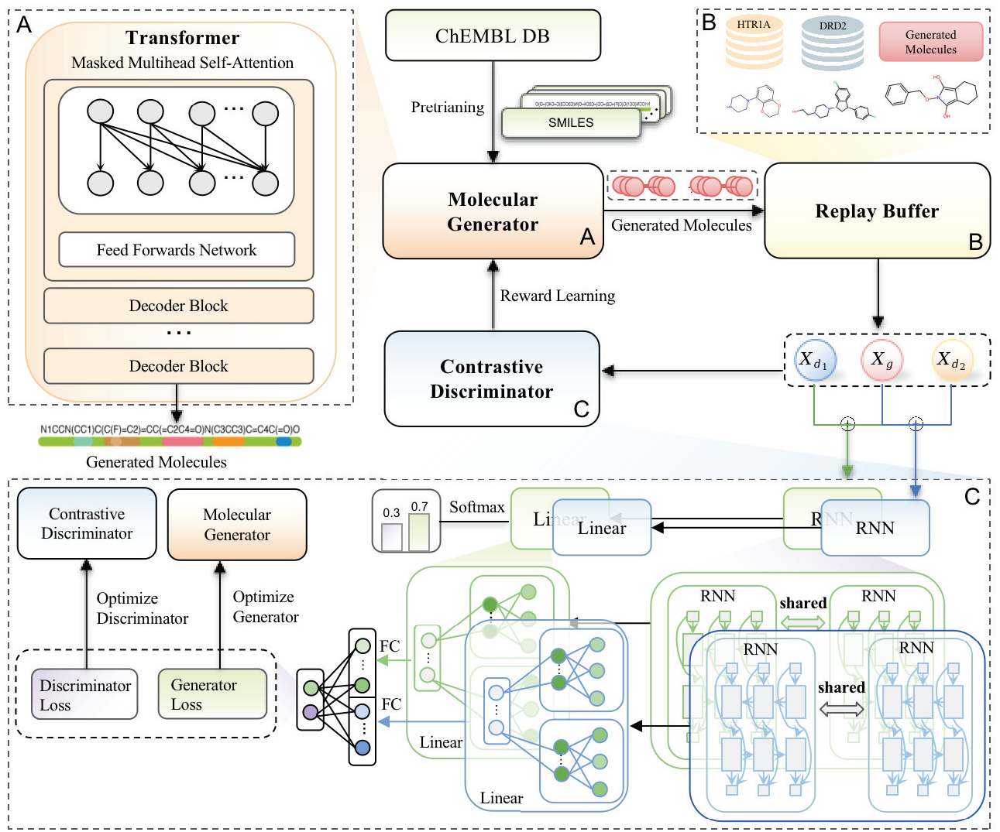

# MolGAIL-master

This is the repository for the paper: #paper name
## Overview
In this study, a new model, MTMol-GPT, is proposed for generating multiple target molecules. MTMol-GPT is a generation model based on transformer. A contrast discriminator is introduced to calculate rewards based on the relationship between generated molecules and real molecules with different protein-target biological activities. The working flow of our model is as follows:

The details of MTMol-GPT is as follows:

## Requirements
| Library/Project | Version     |
|-----------------|-------------|
| asposestorage   |1.0.2|
| hydra-core      |1.2.0|
| joblib          |1.0.1|
| matplotlib      |3.3.4|
| moses           |0.10.0|
| numpy           |1.20.1|
| omegaconf       |2.2.3|
| pandas          |1.2.4|
| rdkit           |2022.9.1|
| scikit_learn    |1.1.3|
| seaborn         |0.11.1|
| selfies         |2.1.1|
| toolkits        |0.2.0|
| torch           |1.8.1|
| tqdm            |4.59.0|
| wandb           |0.13.5|

You can install the dependencies by ```./requirements.txt```
## Datasets
We used the DRD2 and HTR1A target data of DLGN to train and test our model. 
The following table is the details of the dataset.

| Datasets          | Train | Valid |Test|
|-------------------|-------|---|---|
| Chembl (pretrain) |344184||
| DRD2 target       |1293 |431 |432|
| HTR1A target      |1672 |557 |558|

## Hyperparameters
All hyperparameters are stored in ```.yaml``` format and will be automatically loaded by the script. You can adjust them according to your tasks.
## Pretrain the generator
This paper needs to pretrain two types of generators (molecular representation based on SMILES and molecular representation based on SELFIES), which can be run as follows for pretraining SMILES's based generator:

```bash
$ python pretrain.py --config config/train/config_pretrain.yaml use_selfies=False
```
If you want to pretrain the generator based on SELFIES, run the following scripts:
```bash
$ python pretrain.py --config config/train/config_pretrain.yaml use_selfies=True
```
## Train
### Train on multi-target
To train multi-target (DRD2 and HTR1A) MolGAIL based on SMILES, run directly:
```bash
$ python gail_multitarget/finetune.py  
```
To train MolGAIL in the form of SELFIES, set  ```use_selfies: True``` in the file `.\config\train` , and then run:
```bash
$ python gail_multitarget/finetune.py 
```

### Train on single-target
Train single-target (DRD2 or HTR1A) MolGAIL based on SMILES. Run following scripts:
```bash
$ python gail_singletarget/finetune.py 
```

To train single-target MolGAIL in the form of SELFIES, set  ```use_selfies: True``` in the file `.\config\train` , and then run:
```bash
$ python gail_singletarget/finetune.py 
```
## Generation
### Generation on multi-target
After model training, use the trained model to generate molecules. For SMILES-based and SELFIES-based multi-target model, run following script:
```bash
$ python gail_multitarget/finetune_generation.py
```
### Generation on single-target
For single-target, run following script for both SMILES-based and SELFIES-based model:
```bash
$ python gail_singletarget/finetune_generation.py
```

## Evaluation
After the model generates molecules, the following script can be run to evaluate the generated molecular for multi target:

```bash
$ python gail_multitarget/eval_gen_smiles.py
```
For single target, run the following script:
```bash
$ python gail_singletarget/eval_gen_smiles.py
```

If you want to train other multi target data, you can collect multi target dataset by yourself and then train the model, generate molecules and evaluate molecules.
